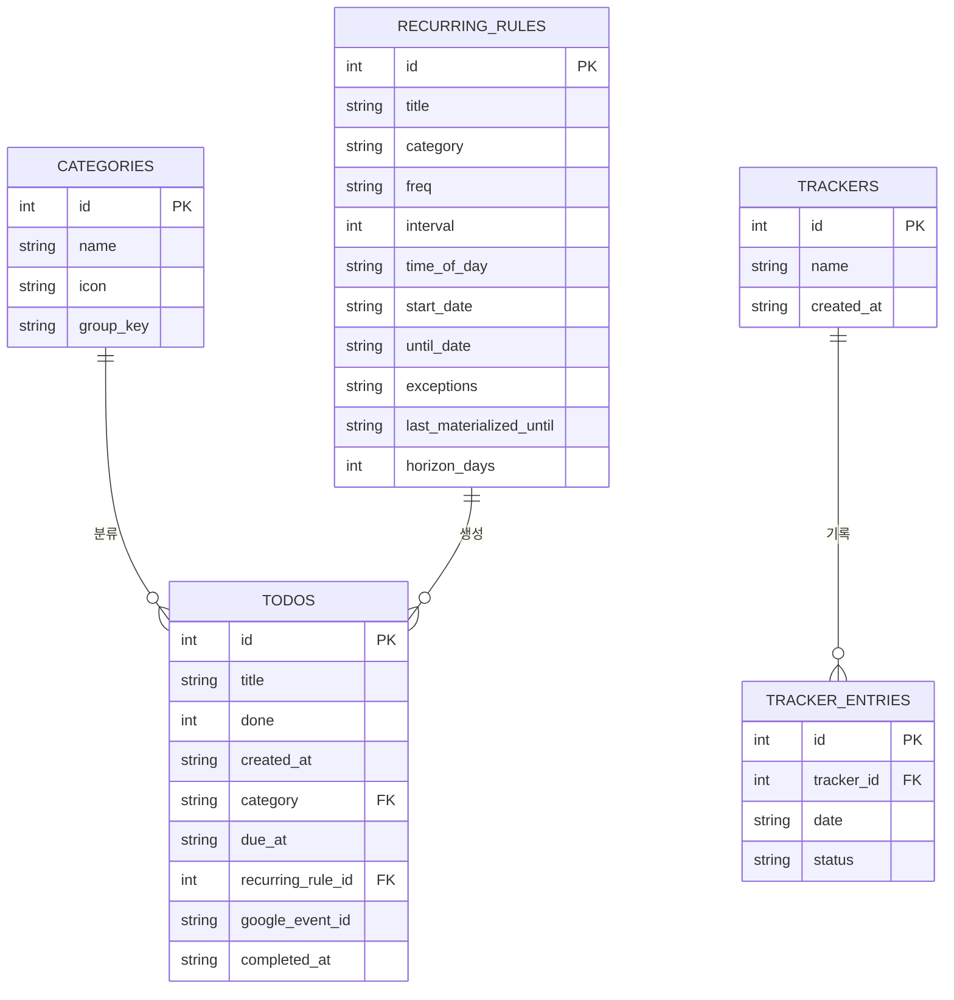

# 내 컴퓨터용 Todo 앱 — PRD

## 세션 인계 노트 (다시 작업을 시작할 때 먼저 읽을 것)

- **지금까지 구현된 것**: 기본 CRUD(추가/목록/완료/삭제), SQLite 영구 저장(`todo.db`), 카테고리(기본 6종 프리셋 + 개인 추가, 그룹별 같은 색상으로 "계열" 표시, 매칭되는 이름이 없으면 "기타"로 기본 지정 — 뱃지 클릭으로 즉시 수정), 검색+카테고리 필터, 자연어 빠른 입력(`nlp.py`, 규칙 기반 한국어 날짜/시간 파서, 12h/24h 통일 처리), 반복 일정(`recurring.py`, `dateutil.rrule` 기반 매일/매주/격주 + 예외 기간 지정 — 종료일 지정 시 그 날짜까지 전부 즉시 생성, 종료일 없는 반복만 60일 horizon으로 서버 시작 시 자동 보충 생성), 자연어로 반복 일정 표현("8/3-11/5 격주 공원 산책", "매일 9:50 약 복용" 등 — 종료일이 문장에 없으면 앱이 먼저 "언제까지 반복할까요?" 확인 후 생성), 구글 캘린더 연동(`calendar_sync.py`, 읽기 전용 OAuth — 다가오는 이벤트를 "제안된 할 일"로 보여주고 수락한 것만 저장, 사용자가 OAuth 인증까지 완료해서 실제 조회 성공 확인함), **지난 할 일 확인**(마감이 지났는데 미완료인 항목을 앱이 열려있는 동안 주기적으로 감지 → 완료/다시 일정 잡기/나중에(스누즈, localStorage) 선택 + 브라우저 알림, 앱이 닫혀있으면 알림 없음 — 사용자가 이 범위로 확정함), **왼쪽 사이드바**(달력 — 날짜 클릭 시 그 날 할 일만 필터링, **다중 습관 트래커**(§15) — 할 일과 무관하게 이름 붙여 원하는 만큼 만들고 날짜 칸 클릭으로 완료/실패 직접 기록, **뉴스 카드 위젯**(§14·§15) — 카테고리별 헤드라인).
- **다음 작업**: 없음. 남은 후보: StudioMate 수동 일괄 입력 기능(§2 보류 항목).
- **카테고리 완전 커스터마이징(2026-07-20 완료)**: `/api/categories/{name}` PATCH(이름·아이콘·그룹 변경, 변경 시 관련 todos/recurring_rules도 같이 갱신)·DELETE(삭제 시 해당 카테고리를 쓰던 항목은 카테고리 없음으로) 추가. 상세 입력의 카테고리 선택창에서 "⚙ 카테고리 관리"로 접근.
- **GitHub 공개 전 코드 리뷰(2026-07-20 완료)**: 독립적인 code-reviewer 서브에이전트로 전체 코드 점검 후 수정: (1) `nlp.py`의 "시" 정규식이 "시간"(예: "1시간 후")까지 시각으로 잘못 인식하던 버그 수정(`(?!간)` 부정형 전방탐색 추가), (2) `db.py`의 `get_connection()`을 진짜 컨텍스트 매니저로 바꿔 커넥션이 확실히 닫히도록 함, (3) 반복 일정 생성 시 유효성 검사(`_validate_recurring_input`)를 `/api/recurring`과 빠른 입력 반복 경로 양쪽에서 공유하도록 통합, (4) 구글 캘린더 "제안 수락" 시에도 카테고리 자동 매칭 적용, (5) FastAPI `@app.on_event("startup")` → `lifespan` 방식으로, `datetime.utcnow()` → `datetime.now(timezone.utc)`로 교체(둘 다 지원 종료 예정 API). `.gitignore`는 리뷰에서 이미 올바르게 비밀 파일들을 제외하고 있음을 확인함.
- **자연어 빠른 입력에 제외 기간 지원 추가(2026-07-20 완료)**: "5/1-9/30 격주로 산책, 9월 첫째주 제외"처럼 반복 문장에 `, <기간> 제외`를 붙이면 그 구간만 건너뜀. 명시적 날짜 범위(`M/D-M/D 제외`)와 "M월 N째주 제외"(그 달의 1~7일=1주차, 8~14일=2주차 …) 둘 다 인식. 문장당 제외 구간은 1개까지만 인식(여러 개 필요하면 상세 입력의 "제외 기간 추가" 사용). 구현 중 발견한 버그: 제외 구간의 연도를 "오늘" 기준으로 계산했더니 반복 시작일이 연도를 넘겨 다음 해로 잡힌 경우(예: 5/1이 이미 지나서 내년으로 잡힘) 제외 구간은 엉뚱하게 올해로 계산되는 문제가 있었음 — 제외 구간 연도 계산 기준을 "오늘"이 아니라 반복 규칙 자체의 확정된 시작일로 바꿔서 해결. 사용자가 실제로 겪은 버그(제목에 "산책, 9월 첫째주 제외"가 그대로 남고 제외도 적용 안 됨)였던 실제 반복 일정도 삭제 후 고친 파서로 다시 만들어둠.
- **"{요일}마다" 반복 트리거 추가(2026-07-20 완료)**: "수요일마다 산책"처럼 요일+"마다"를 반복 트리거로 인식(WEEKLY, interval=1, 시작일은 다음 그 요일로 자동 계산). **바로 다음 세션에서 사용자가 실제로 겪은 문제**: "수요일 산책, 9월 첫째주 평일 제외"라고만 쓰면(마다/매주 등 트리거 단어 없이 요일만 언급) 반복으로 인식되지 않고 그냥 그 요일의 단일 할 일 하나로 처리됨 — 의도된 동작(예: "화요일에 병원"처럼 요일만 언급하는 대부분의 경우는 "이번 한 번"을 뜻하지, "매주 반복"을 뜻하지 않으므로, 오해로 인해 반복 일정이 잘못 만들어지는 걸 막기 위함). 이 원칙과 트리거 단어 목록(매일/매주/격주/날짜범위/{요일}마다)을 README에 명확히 문서화함. 또한 **상세 입력의 제목 칸은 자연어 파싱을 전혀 거치지 않고 입력한 그대로 저장된다는 점**도 README에 명시(사용자가 상세 입력 제목에 서술형 문장을 쓰고 자동 파싱을 기대했던 것으로 추정되는 사례 발생).
- **여러 개 선택 후 일괄 삭제 + 트래커 개선(2026-07-20 완료)**: 할 일 제목/시각 부분을 클릭하면 선택(파란 배경 표시), Shift+클릭하면 마지막 선택 지점부터 지금 클릭한 항목까지 범위 선택(탐색기 스타일). 선택된 게 있으면 목록 위에 "N개 선택됨" + 삭제/선택 해제 버튼이 뜸. 트래커는 롤링 12주 대신 **이번 달**(그 달 일수만큼, 요일 맞춰 정렬)만 보여주고, 칸 모양도 네모에서 **동그라미**로 변경(`GET /api/tracker`가 이제 `weeks` 대신 `year`/`month`를 받음, 기본값은 오늘 기준 해당 월).
- **주의(반복 발생)**: 코드를 고쳐도 사용자의 실제 서버가 `--reload`인데 자동으로 재시작되지 않는 경우가 있었음(WatchFiles가 변경을 못 감지한 것으로 추정) — 이땐 서버 프로세스를 강제 종료하려 해도 AI 도구의 taskkill/PowerShell Get-Process 양쪽 다 그 프로세스를 "찾을 수 없음"이라고 나오면서도 포트는 계속 점유되어 있는 경우가 있었다(추정: 사용자가 직접 연 터미널의 프로세스라 AI 도구의 프로세스 목록에서 안 보이는 것 — §PRD 사용자 실제 PC/샌드박스 분리 노트 참고). 이 경우 사용자에게 본인 터미널에서 직접 Ctrl+C 후 재시작해달라고 요청하는 것 외에 다른 해결책이 없었음.
- **체크박스 Shift+클릭 선택 + 다중 완료 처리(2026-07-20 완료)**: 처음엔 제목/시각 클릭만 선택 수단이었는데, 사용자가 실제로 "완료" 체크박스를 선택 수단으로 착각해 시도하다 안 됨을 겪음 — 체크박스도 **Shift+클릭하면 선택**되도록 추가(그냥 클릭은 기존처럼 완료 토글 유지). 추가로, **2개 이상 선택된 상태에서 그중 하나의 체크박스를 클릭(Shift 없이)하면 선택된 항목 전체가 한꺼번에 완료/미완료 처리**되도록 구현(`PATCH /api/todos/{id}/done` 신규 엔드포인트로 명시적 완료 상태 지정 — 기존 `/toggle`은 현재 상태를 뒤집기만 해서 여러 항목에 동일한 목표 상태를 일괄 적용하기엔 안 맞았음).
- **작업 방식**: 코드 수정 후 반드시 별도 포트(예: 8001)에 임시 서버를 띄워 브라우저로 실제 동작을 확인한다 — `todo.db`가 사용자의 실제 데이터와 공유되므로, 테스트로 넣은 데이터는 확인 후 반드시 API로 정리한다. 자세한 내용은 §8 참고.
- **주의**: 이 프로젝트는 AI 어시스턴트의 도구 실행 환경(샌드박스)과 사용자의 실제 PC가 완전히 같은 프로세스 공간이 아니다. `Documents\todo-app` 폴더 자체(코드, venv 안의 설치된 패키지 포함)는 실제 PC와 공유되지만, **실행 중인 서버 프로세스는 공유되지 않는다.** 그래서 서버는 항상 사용자가 자기 PC의 터미널(cmd 또는 PowerShell)에서 직접 실행해야 하고, 코드/의존성 변경 후에는 서버를 껐다 켜거나 `pip install -r requirements.txt`를 다시 돌려야 할 수 있다.

## 1. 배경 및 목적

기존 할 일 관리 앱 대신 내 컴퓨터에서 직접 도는 개인용 Todo 앱을 만든다. AI 에이전트 코스를 듣고 있어 실습 겸 포트폴리오 성격도 있다.

**핵심 반복 워크플로**: 매주 토요일 필라테스 스튜디오(StudioMate 앱)에서 다음 주 수업을 예약하고, 그 일정을 손으로 구글 캘린더에 옮겨 적는 게 번거로웠던 것이 이 프로젝트의 실질적 출발점이다.

## 2. 범위

### v1 (완료)
- 기본 CRUD + SQLite 영구 저장. **여러 개 선택**(제목/시각 클릭 또는 체크박스 Shift+클릭, 범위는 Shift+클릭으로) **후 일괄 삭제 또는 일괄 완료/미완료 처리** 가능.
- 카테고리: 기본 6종(운동/업무/공부/집안일/약속/기타) + 사용자가 직접 추가 가능, 그룹(계열)이 같으면 같은 색으로 표시. **이름·아이콘·그룹 수정 및 삭제도 가능**("⚙ 카테고리 관리" 패널) — 이름을 바꾸면 그 카테고리를 쓰던 할 일/반복 규칙도 같이 갱신되고, 삭제하면 해당 항목들은 카테고리 없음이 됨.
- 검색 + 카테고리 필터
- 완료 시 취소선, 등록/마감 시각 표시(요일 포함)
- **자연어 빠른 입력**: "내일 오후 1시에 네일숍" → 제목+마감시간 자동 인식 (규칙 기반, 무료, 인터넷 불필요). 12시간(오전/오후 N시)과 24시간(콜론, 예: 20:30) 표기 둘 다 인식.
- **반복 일정**: 매일/매주/격주 + 예외 기간(예: 방학) 지정 가능, RRULE 방식 채택(`dateutil.rrule`). **종료일은 필수**(상세 입력에서 반복을 고르면 종료일도 반드시 채워야 제출됨) — 종료일이 있으면 그 날짜까지 전부 즉시 생성되고, 60일 horizon은 종료일 없는 반복에만 적용됨(2026-07-20 수정, §9 참고).
- **카테고리 자동 지정 + 손쉬운 수정**: 빠른 입력 문장에 기존 카테고리 이름이 그대로 포함되어 있으면(예: "필라테스 예약" → "필라테스" 카테고리) 자동으로 채워짐. 매칭되는 카테고리가 없으면 **"기타"로 기본 지정**됨(2026-07-20 변경 — 예전엔 빈 채로 남겨서 매번 "+카테고리" 클릭이 필요했음). 목록의 카테고리 뱃지를 클릭하면 그 자리에서 바로 다른 카테고리로 바꿀 수 있음. **문장 의미를 추론해서 새 카테고리를 만들어내지는 않음**(예: "헬스장 가기"를 보고 "운동"을 알아서 갖다 붙이진 않음, "운동"이라는 단어 자체가 문장에 있어야 매칭됨) — 새 카테고리를 계속 만들어내는 위험 없이, 이미 있는 카테고리끼리는 매칭.
- **자연어로 반복 일정 표현**: "8/3-11/5 격주 공원 산책", "매일 9:50 약 복용"처럼 짧게 써도 반복 일정으로 인식(날짜 범위 `M/D-M/D` 또는 `M월 D일부터 M월 D일까지`, 반복 주기 `매일`/`매주`/`격주` 키워드 인식). 문장에 종료일이 없으면(예: "매일 9:50 약 복용") 바로 만들지 않고 **"언제까지 반복할까요?" 확인 UI**(날짜 직접 입력 또는 +1/3/6개월 버튼)를 먼저 보여준 뒤 확정되면 생성함 — 60일 같은 임의의 기본값을 조용히 쓰지 않음. 반복 키워드가 없으면 기존처럼 단일 할 일로 처리됨. **제외 기간도 같은 문장에 붙여서 표현 가능**(2026-07-20 추가): "5/1-9/30 격주로 산책, 9월 첫째주 제외"처럼 `, <기간> 제외`를 붙이면 그 구간만 건너뜀 — 명시적 날짜 범위(`M/D-M/D 제외`)와 "M월 N째주 제외"(그 달의 1~7일=1주차 기준) 둘 다 인식. 문장당 1개까지만 인식.

### v1.5 (완료, 2026-07-20)
- 구글 캘린더 연동(공식 API, OAuth, 읽기 전용) — 다가오는 이벤트를 "제안된 할 일"로 보여주고 수락 시에만 저장. 설정 방법은 §10 참고.

### v1.6 (완료, 2026-07-20)
- **지난 할 일 확인 + 알림**: 마감 시각이 지났는데 완료 처리(취소선)가 안 된 항목을 앱이 열려있는 동안 60초마다 감지해서 "확인이 필요한 지난 할 일" 섹션에 보여줌. 항목마다 완료/다시 일정 잡기(날짜·시간 다시 지정)/나중에(3시간 스누즈, `localStorage`에 저장) 선택 가능. "🔔 알림 켜기"를 누르면 브라우저 Notification API로도 알려줌. **범위를 명확히 앱이 열려있을 때만으로 한정**함(브라우저를 안 켜놔도 오는 알림은 별도의 상시 백그라운드 프로세스가 필요해서 훨씬 큰 작업 — 사용자가 이 범위로 확정).
- **왼쪽 사이드바(달력 + 완료 기록 히트맵)**: 상단에 월간 달력(할 일 있는 날짜에 점 표시, 클릭하면 그 날짜 할 일만 필터링), 하단에 **이번 달**(2026-07-20 수정 — 원래는 최근 12주였음) 완료 개수를 색 농도의 **동그라미**(2026-07-20 수정 — 원래는 네모)로 보여주는 히트맵. 완료 시각(`todos.completed_at`)을 기준으로 집계.

### 보류/제외 (Out of scope)
- **StudioMate(필라테스 등 스튜디오 예약 앱) 자동 연동**: 공식 API·캘린더 내보내기(.ics)·이메일/문자 확인 발송 전부 없음(2026-07-20 조사 완료). 로그인 자동화(스크래핑)는 약관 위반 소지 + 비밀번호 저장 위험이 있어 채택하지 않음. → 앱 내 "이번 주 수업 일괄 추가" 같은 빠른 수동 입력으로 대체(아직 미구현, 필요 시 백로그)
- **이메일(Gmail) 기반 할 일 자동 제안**: Gmail API 자체는 무료로 가능하지만, "이 메일이 할 일인지" 판단하는 정확도가 규칙 기반으론 부족(광고 메일 오탐 등). 정확도를 높이려면 AI 모델 호출이 필요한데 "무료 도구만" 원칙과 충돌 → 보류
- **카테고리를 문장 의미로 추론해서 완전 자동 생성**: 문맥을 이해해서 없는 카테고리를 새로 만들어내는 건 여전히 하지 않음(비슷한 카테고리가 계속 생겨 지저분해질 위험) — 위 v1 항목의 "기존 카테고리 이름과 정확히 일치할 때만 자동 매칭"까지만 구현

## 3. 규칙

- 무료 도구만 사용
- 비밀값(API 키 등)은 `.env`로 관리
- 로그인 관련 기능은 직접 구현하지 않고 검증된 라이브러리 사용 (구글 캘린더는 `google-auth-oauthlib` 공식 라이브러리 사용)

## 4. 기술 스택

- Python + FastAPI + Uvicorn (로컬 실행)
- SQLite (`sqlite3` 표준 라이브러리, 별도 설치 불필요)
- `python-dateutil` (반복 일정 계산)
- `google-auth-oauthlib` + `google-api-python-client` (구글 캘린더 OAuth·API 호출)
- `python-dotenv` (`.env` 설정값 로딩)
- 프론트엔드: 프레임워크 없이 순수 HTML/CSS/JS (`static/`), FastAPI가 그대로 서빙
- 실행 환경: 사용자 PC의 `venv` (프레임워크·라이브러리는 무료 오픈소스)

## 5. 파일 구조

```
todo-app/
├── main.py                    # FastAPI 앱, 라우트 전체
├── db.py                      # SQLite 연결, 스키마, 카테고리 그룹 상수
├── nlp.py                     # 자연어 빠른 입력 파서 (규칙 기반)
├── recurring.py               # 반복 일정 회차 생성 (dateutil.rrule)
├── calendar_sync.py           # 구글 캘린더 API 클라이언트 (읽기 전용)
├── setup_google_calendar.py   # OAuth 최초 설정용 1회 실행 스크립트 (사용자가 직접 실행)
├── requirements.txt
├── .env.example                # .env로 복사해서 쓰는 설정 예시
├── static/
│   ├── index.html
│   ├── app.js
│   └── style.css
├── todo.db          # SQLite 데이터 파일 (실행 시 생성, 실제 데이터)
├── credentials.json  # 사용자가 직접 준비 (Google Cloud Console 다운로드본, git 커밋 금지)
├── token.json         # setup_google_calendar.py 실행 후 자동 생성 (git 커밋 금지)
└── venv/            # 가상환경 (커밋 대상 아님)
```

## 6. 데이터 모델



- `categories.group_key`는 `db.py`의 `GROUPS` 상수(운동/업무/공부/집안일/약속/기타, 각각 고정 색상)를 가리킨다. 같은 그룹에 속한 카테고리는 항상 같은 색으로 표시된다(예: "필라테스" 카테고리를 "운동" 그룹으로 만들면 기존 "운동" 카테고리와 같은 파란색).
- SQLite라 FK를 실제로 강제하진 않지만(`category`는 이름 문자열 매칭), 관계는 위 다이어그램대로 동작한다.
- `trackers`/`tracker_entries`는 `todos`와 완전히 독립적이다(§15) — 할 일의 완료 여부와 무관하게 사용자가 직접 기록하는 습관 트래커용 테이블. `tracker_entries`는 `(tracker_id, date)` 조합에 `UNIQUE` 제약이 있어 하루에 한 상태만 남는다. `status`는 `"done"`/`"failed"` 중 하나이거나, 기록이 아예 없으면(빈칸) 행 자체가 없다.

## 7. 구조도 (전체 아키텍처)

- **로컬(내 컴퓨터)**: 브라우저 UI → FastAPI 서버 → SQLite, 셋 다 인터넷 없이 동작하는 무료 구성.
- **외부 연동**: 구글 캘린더만 유일한 외부 서비스. OAuth로 사용자가 직접 동의해야 하고(AI가 대신 로그인할 수 없음), 동의 후 서버가 다가오는 일정을 읽어와 "제안함" 목록으로 보여준 뒤, 사용자가 수락한 항목만 SQLite에 실제 할 일로 저장된다.

## 8. 작업 원칙 (반드시 지킬 것)

- 코드 변경 후 사용자의 실제 서버(포트 8000)와 겹치지 않는 별도 포트(예: 8001)에 임시 서버를 띄워 브라우저로 직접 클릭/입력해보고 검증한다.
- `todo.db`는 사용자의 실제 데이터가 들어있는 공유 파일이므로, 테스트로 추가한 항목은 검증 후 반드시 API로 삭제해 정리한다.
- 라이브러리를 새로 추가하면 `requirements.txt`에도 반영하고, 사용자에게 본인 터미널에서 `pip install -r requirements.txt`를 다시 실행해야 함을 안내한다.

## 9. 알려진 한계

- 자연어 빠른 입력은 규칙 기반이라 정해진 표현 패턴(오늘/내일/모레/글피, 요일, N일 후, M월 D일, 오전·오후 N시)만 인식한다. 시간 없이 숫자만 있는 경우(예: "5시") 오전/오후 추정은 휴리스틱(1~6시는 오후로 간주)이라 틀릴 수 있음.
- 반복 일정에 **종료일을 지정하면 그 날짜까지 전부 한 번에 생성**된다(2026-07-20 수정 — 예전엔 60일 제한에 걸려 종료일보다 먼저 끊겼었음, 버그로 확인되어 수정함). **종료일 없이 계속되는 반복만** 앞으로 60일치씩 미리 생성해두고 서버가 켜질 때마다 자동으로 더 채워 넣는 방식이다 — 이 경우 시작일을 60일보다 먼 미래로 잡으면 그 시점이 다가올 때까지 목록에 안 보일 수 있음(의도된 동작).
- 구글 캘린더 연동은 OAuth 설정(§10)을 사용자가 직접 완료해야만 동작한다. 아직 설정 전이면 "제안된 할 일" 섹션이 그냥 보이지 않는다(에러 아님).
- **지난 할 일 알림은 브라우저 탭이 열려있을 때만** 온다(60초 주기 검사). 브라우저를 꺼두면 알림이 오지 않는다 — 항상 오게 하려면 OS 예약 작업 같은 별도의 상시 백그라운드 프로세스가 필요한데, 이는 구축이 더 복잡해서 채택하지 않기로 함(사용자 확정).

## 10. 구글 캘린더 연동 설정 방법 (최초 1회, 본인이 직접 해야 함)

OAuth 동의는 AI가 대신할 수 없다 — 본인 구글 계정으로 직접 로그인/동의해야 한다.

1. [Google Cloud Console](https://console.cloud.google.com)에서 새 프로젝트 생성 (또는 기존 프로젝트 사용)
2. "API 및 서비스 → 라이브러리"에서 **Google Calendar API** 검색 후 사용 설정
3. "API 및 서비스 → OAuth 동의 화면": 사용자 유형 **외부(External)** 선택 → 앱 이름/이메일만 채우고 저장 → "테스트 사용자"에 본인 구글 계정 이메일 추가 (개인용이라 게시 심사는 필요 없음)
4. "API 및 서비스 → 사용자 인증 정보 → 사용자 인증 정보 만들기 → OAuth 클라이언트 ID": 애플리케이션 유형 **데스크톱 앱** 선택
5. 생성된 클라이언트의 JSON을 다운로드해 `credentials.json`이라는 이름으로 `todo-app` 폴더에 저장
6. 본인 터미널에서 실행:
   ```
   cd todo-app
   venv\Scripts\activate
   python setup_google_calendar.py
   ```
   브라우저가 열리면 로그인 + 동의 → "연결 완료!" 메시지가 뜨면 `token.json`이 생성된 것
7. 서버(`uvicorn main:app --reload --reload-exclude=venv/* --reload-exclude=__pycache__/*`)를 재시작하면 홈 화면에 "제안된 할 일" 섹션이 나타난다 (다가오는 일정이 없으면 안 보이는 게 정상)

## 11. 서버가 자꾸 다운되는 문제 (2026-07-21 해결)

- **증상**: 사용자가 서버를 켜두고 쓰다 보면 간헐적으로 "사이트에 연결할 수 없음"이 뜸.
- **원인**: `uvicorn --reload`가 기본적으로 프로젝트 폴더 전체를 감시하는데, 여기에 `venv/`도 포함되어 있었다. pip나 파이썬이 가상환경 내부에 남기는 사소한 파일 변경(캐시 등)까지 전부 "코드가 바뀌었다"고 오인해 리로드를 반복 트리거하면서 서버가 불안정해짐.
- **해결(1차, 불완전했음)**: `--reload-exclude=venv/*`와 `--reload-exclude=__pycache__/*`를 추가해 감시 대상에서 제외. **주의**: 반드시 `=`로 값을 붙여야 한다 (`--reload-exclude venv/*`처럼 공백으로 띄우면 일부 셸에서 글롭이 미리 확장되어 파싱 에러가 남).
- Windows용 `start.bat`을 새로 만들어 이 옵션이 포함된 실행 명령을 고정해둠 — 매번 옵션을 기억해서 타이핑할 필요 없이 더블클릭으로 실행 가능.
- **2차 재발 및 진짜 원인(2026-07-21 재조사)**: 1차 수정 이후에도 "서버가 다운된다"는 보고가 계속됨. 실제로 `start.bat`을 cmd.exe로 직접 실행해서 재현한 결과 두 가지 문제가 겹쳐 있었다:
  1. **`start.bat`이 애초에 실행조차 안 되고 있었음**: `--reload-dir="%~dp0"`에서 `%~dp0`가 백슬래시로 끝나는데, 그 바로 뒤에 닫는 따옴표(`\"`)가 오면 uvicorn 실행기의 인자 파서가 이걸 "이스케이프된 따옴표"로 해석해버려 뒤따르는 옵션 전부가 하나의 잘못된 인자로 뭉개지고, uvicorn이 시작하자마자 `Invalid value` 에러로 죽었다. `%~dp0` 뒤에 `.`을 붙여 해결(`--reload-dir="%~dp0."`).
  2. **`--reload-exclude=venv/*`가 실제로는 중첩된 파일을 전혀 못 걸렀음**: `venv/*` 같은 글롭은 `venv` 바로 한 단계 아래 파일만 제외하고, `venv/Lib/site-packages/fastapi/...`처럼 더 깊은 파일은 그대로 감시 대상에 남는다(파이썬 `Path.match()`의 특성). 실제로 그 안의 파일 하나를 `touch`만 해도 서버가 재시작하는 걸 재현해서 확인함. **진짜 해결**: 제외 경로를 상대경로가 아니라 **절대경로**로 줘야 한다 — uvicorn이 제외 디렉터리를 비교할 때 정확한 경로 일치를 보는데, `--reload-dir`가 넘기는 감시 경로는 절대경로라서 상대경로 `venv`는 절대 일치하지 않는다. `start.bat`은 `%~dp0venv`/`%~dp0__pycache__`로, README의 수동 실행 커맨드는 `$(pwd)/venv`로 고침. 고친 뒤 같은 방식(중첩 파일 touch)으로 재현 시도해서 더 이상 재시작이 안 뜨는 것까지 확인함.
- 이 문제는 AI가 대신 고칠 수 없는 부분도 있다: 사용자가 본인 터미널에서 직접 띄운 서버 프로세스는 AI 쪽 도구로 종료/확인이 안 되는 경우가 있었음(포트는 공유되어 보이지만 프로세스 목록엔 안 보임). 이런 경우 사용자가 본인 터미널에서 직접 Ctrl+C 후 재시작해야 한다.

## 12. 완료 트래커 v2 — 날짜 숫자 + 달성률 색상 (2026-07-21)

- 기존엔 그냥 완료 개수만 세서 진하기를 정했는데, "마감된 할 일 대비 완료 비율(%)"로 바꿈. 하루에 할 일이 하나도 없으면 무색, 있으면 완료율에 따라 5단계로 진해짐 (0%<25%<50%<75%<100%).
- 셀에 날짜 숫자를 표시하고 크기를 20px로 키움 (기존엔 너무 작아서 안 보인다는 피드백).
- `/api/tracker`가 `{date, day, total, done, rate}` 배열을 반환하도록 재작성.

## 13. 다중 선택 — 전체 선택 버튼 (2026-07-21)

- 목록 위에 "전체 선택" 버튼 추가 — 현재 화면에 보이는 모든 항목을 한 번에 선택 상태로 만듦.

## 14. 뉴스 위젯 (2026-07-21)

- 사이드바 트래커 아래에 카테고리(정치/경제/사회/IT/스포츠/세계) 선택 드롭다운 + 헤드라인 목록 추가.
- **데이터 출처**: 경향신문(khan.co.kr) 공개 RSS 피드. API 키가 필요 없는 무료 소스라서 선택함.
  - 처음엔 한경(hankyung.com) RSS도 후보였는데, 실제로 `feedparser`/`urllib`로 직접 요청해보니 (기본 User-Agent든 브라우저로 위장한 User-Agent든) 매번 403 Forbidden이 나서 제외함. 서브에이전트가 "작동 확인함"이라고 보고한 적 있었지만, 내 실제 실행 환경에서 독립적으로 재검증하니 안 됐다 — 다른 컨텍스트에서의 "검증됨" 주장을 그대로 믿지 않고 항상 직접 재확인한다는 이 프로젝트의 원칙이 여기서도 적용됨.
  - 스포츠 카테고리는 URL이 `sports_news.xml`이 아니라 `kh_sports.xml`이었음 (전자는 302 리다이렉트만 뜨고 `feedparser`가 못 따라감).
- 백엔드(`GET /api/news?category=...`)에서 카테고리별로 10분 캐시를 둠 — 새로고침마다 매번 외부 RSS를 다시 긁어오지 않도록.
- `feedparser` 라이브러리를 새로 추가함 → `requirements.txt`에 반영, 본인 터미널에서 `pip install -r requirements.txt` 다시 실행 필요.

## 15. 다중 Tracker + 뉴스 카드 UI 전면 개편 (2026-07-21)

- **완료율 히트맵 → 이름 붙인 다중 습관 트래커로 교체**: 기존엔 트래커가 하나뿐이고 그날 마감된 할 일의 완료율을 자동 계산해 색칠하는 방식이었음(§12). 이번에 요청받아 완전히 다른 개념으로 바꿈 — 할 일과 무관하게 사용자가 직접 이름(운동/독서/금주 등)을 붙여 원하는 만큼 트래커를 만들고, 날짜 칸을 클릭해 빈칸→○(완료, 초록)→✕(실패, 빨강)→빈칸 순으로 직접 기록하는 방식. `GET /api/tracker`(단수, 할 일 기반 자동 집계)는 완전히 제거하고 `trackers`/`tracker_entries` 테이블 + `/api/trackers` 계열 API(목록·생성·복제·날짜별 기록 조회/설정)로 교체.
  - 복제 시 이름은 항상 새로 입력받고, 기존 기록 복사 여부는 체크박스로 선택(`copy_data`) — 기본은 빈 상태로 시작.
  - **Tracker UI를 진짜 달력 그리드로 통일**: 요청대로 사이드바 상단 달력과 셀 크기·여백·CSS를 완전히 같은 클래스(`calendar-day`, 공용 `.grid-calendar`/`.grid-weekdays`)로 공유하도록 리팩터링 — 두 위젯의 날짜 칸이 코드 레벨에서도 같은 스타일 규칙을 쓴다.
  - Tracker 전환은 사이드바 폭이 좁아 드롭다운으로 구현(탭/사이드리스트 대신) — 여러 개를 만들어도 좁은 공간에서 안 깨짐.
  - 삭제 기능은 요청에 없어서 넣지 않음(생성/복제만 구현) — 필요해지면 추가 요청 바람.
- **뉴스 위젯 카드형 개편 → 같은 날 완전히 제거함**: `<li>` 목록 → 카드(제목/출처·날짜/요약 2~3줄) 개편에 카테고리(정치/경제/IT/과학/문화/스포츠/사회/세계 + 전체 집계)까지 붙였었으나, 사용자가 "현재 할일 앱에서 뉴스는 삭제할게"라고 바로 범위에서 뺌. `/api/news`, `NEWS_FEEDS`, `_fetch_category_articles` 등 백엔드 코드와 `news-widget` 관련 HTML/CSS/JS를 전부 삭제하고 `feedparser` 의존성도 `requirements.txt`에서 제거함 — 죽은 코드를 남기지 않음. (참고로 카테고리 조사 결과 자체는 유효했음: 경향신문 RSS에 실제 존재하는 건 정치/경제/IT/과학/문화/스포츠/사회/세계뿐이고 AI/역사/건강/게임/교육은 대응 피드가 없었음 — 나중에 뉴스 기능을 다시 붙이게 되면 이 조사부터 다시 할 필요는 없음.)

## 16. Tracker를 반복 일정과 실제로 연동 (2026-07-21)

§15에서 만든 Tracker는 할 일과 완전히 무관한 수동 기록 전용이었는데, 사용자가 바로잡음: "매일 운동", "매일 약 먹기"처럼 **반복 일정으로 등록해둔 할 일이 실제로 있고, 그게 지켜지는지를 Tracker로 추적하고 싶다** — 즉 할 일이 완료되는 순간 Tracker도 자동으로 ○가 되어야 함(할 일마다 별도 Tracker 필요, 예: 운동 Tracker·약 Tracker 각각).

- **설계**: `trackers.recurring_rule_id`(nullable) 컬럼 추가. 이 값이 있으면 "연동 Tracker" — 해당 `recurring_rule_id`를 가진 `todos`의 완료 여부로 날짜 칸 상태가 **자동 계산**되고(수동 클릭 비활성화, `tracker_entries`에 아무것도 안 씀), 없으면 기존처럼 완전 수동 Tracker(`tracker_entries`에 직접 기록).
- **연동 시점**: Tracker "생성" 시에만 반복 일정을 고를 수 있음(드롭다운, `GET /api/recurring` 재사용) — 생성 후 연동 대상을 바꾸는 편집 기능은 이번엔 안 만듦(필요하면 요청 바람).
- **자동 상태 계산 규칙**(사용자가 직접 확정): 그 날짜에 해당 반복 일정의 할 일이 있고 완료(`done=1`)면 ○, 아직 완료 안 됐는데 그 날짜가 이미 지났으면 자동 ✕, 오늘이거나 아직 안 지났으면 빈칸(아직 결과를 알 수 없으니). 그 날짜에 해당 반복 일정의 할 일 자체가 없으면(예: 반복 규칙 시작 전) 빈칸.
- **연동 Tracker는 복제·수동 기록 둘 다 막음**: 프론트(버튼 숨김)와 백엔드(400 응답) 양쪽에서 막음 — 복제해봐야 같은 자동 데이터만 반복되고, 수동 클릭도 자동 계산값을 덮어쓸 방법이 없어야 함(둘 다 실제로 curl로 400 확인함).
- 실제 반복 일정 하나를 만들어서(매일, 2개월치) 연동 Tracker를 붙이고: 과거 날짜 미완료 → 자동 ✕, 오늘 미완료 → 빈칸, 오늘 할 일 완료 처리 → 즉시 ○로 바뀌는 것까지 curl로 전부 재현 확인 후 테스트 데이터는 삭제함.

## 17. 구글 캘린더 제안 — 다중 캘린더(다른 계정 포함) 지원 (2026-07-21)

사용자가 "본인 계정 말고 다른 이메일 계정에 일정이 많은데, 구글 캘린더에서 그 계정들을 보이게 해두면 이 앱에서도 보이냐"고 물음. 기존 코드(`calendar_sync.get_upcoming_events()`)는 `calendarId="primary"`로 고정되어 있어 기본 캘린더 하나만 가져오고 있었다 — 다른 계정 캘린더를 공유/구독해 구글 캘린더 화면에 추가해도 이 앱엔 반영이 안 되는 실제 한계였음.

- **구현**: `service.calendarList().list()`로 이 계정에 "보이게"(체크박스 켜짐, `selected: true`) 추가되어 있는 모든 캘린더 목록을 먼저 가져온 뒤, 각 캘린더에서 이벤트를 조회해 하나로 합치고 `due_at` 기준으로 재정렬. 다른 계정에서 공유/구독해 추가한 캘린더도 이 목록에 포함되므로 자동으로 같이 보임.
  - 체크박스를 꺼둔(안 보이는) 캘린더는 `selected`가 없거나 False라 자동으로 제외됨 — "구글 캘린더에 보이게 해두면 이 앱에도 보인다"는 사용자의 기대와 정확히 일치시킴.
  - `event_id`에 `{calendar_id}:{event_id}` 형태로 캘린더 ID를 접두사로 붙임 — 서로 다른 캘린더의 이벤트 ID 문자열이 우연히 같아도(이론상 가능성) `todos.google_event_id`/`ignored_calendar_events`에서 충돌 없이 구분됨.
  - 캘린더 하나(예: 공유가 취소된 캘린더)에서 조회가 실패해도 `HttpError`만 잡아 그 캘린더만 건너뛰고 나머지는 정상 진행 — 한 캘린더 문제로 전체 제안 기능이 죽지 않게 함.
  - 각 제안 항목에 `calendar`(캘린더 이름) 필드를 추가해 프런트에서 "제안된 할 일" 목록에 배지로 표시 — 여러 계정이 섞이면 어느 캘린더에서 온 건지 구분이 안 되는 문제를 막음.
- **검증**: 실제 구글 인증 정보 없이는 API를 직접 두드릴 수 없어(OAuth 로그인은 사용자가 직접 해야 함), `googleapiclient` 호출을 mock으로 대체한 스크립트로 검증 — 체크박스 꺼진 캘린더 제외, 여러 캘린더 이벤트 병합 후 날짜순 재정렬, 동일 이벤트 ID 문자열의 캘린더 간 충돌 방지 세 가지를 모두 확인. 프런트 배지 렌더링은 로컬 서버에 가짜 제안 데이터를 주입해 브라우저로 직접 확인.
- **뒤늦게 발견된 별개 문제**: 사용자가 실제로 다른 계정 캘린더를 구독해 추가했는데도 앱에 안 보인다고 보고함. 서버를 재시작했다고 했으나, 포트 8000을 물고 있던 프로세스의 시작 시각(15:23:30)이 이 수정을 담은 `calendar_sync.py`의 수정 시각(16:12:57)보다 앞서 있어, 실제로는 옛 코드를 그대로 물고 있는 프로세스였음이 드러남(§11에 이미 기록된 "포트를 붙잡은 프로세스가 안 죽는" 문제의 또 다른 사례). 그 프로세스를 강제 종료하고 `start.bat`을 다시 실행해 해결 — 회원님 실제 계정(`gratia21@gmail.com`)의 일정이 정상적으로 제안 목록에 뜨는 것까지 확인함.

## 17-1. 제안 다중 선택 + 일괄 수락 (2026-07-21)

다른 계정 캘린더 연동(§17) 이후 제안 개수가 한 번에 20개 이상으로 늘어나면서, 하나씩 "추가"를 눌러야 하는 게 번거롭다는 피드백. 할 일 목록의 기존 다중 선택/일괄 처리 패턴(체크박스 + "전체 선택" + 일괄 작업 바)을 제안 목록에도 그대로 적용함.

- **구현**: 제안 각 항목에 체크박스 추가, 목록 위에 "전체 선택" 버튼, 1개 이상 선택되면 나타나는 일괄 작업 바("N개 선택됨" + "선택 추가"/"선택 해제"). "선택 추가"는 새 엔드포인트를 만들지 않고 기존 `/api/calendar/suggestions/accept`를 선택된 항목 수만큼 `Promise.all`로 병렬 호출 — 할 일 목록의 `bulkSetDone()`과 같은 방식.
- 제안 목록이 새로고침될 때마다(수락/무시 이후) 이미 사라진 이벤트는 선택 상태에서도 자동으로 정리됨(`liveIds`로 필터링) — 새로 받아온 제안 배열에 없는 event_id가 선택 상태에 남아 다음 일괄 작업에 잘못 끼어드는 사고를 방지.
- **검증**: 실제 서버(회원님의 실제 구글 계정 데이터)에서 2건을 선택해 "선택 추가" 실행 → 할 일 2건이 정확한 제목/시간으로 생성되고 제안 목록에서 정확히 그 2건만 사라지는 것(21건→19건)을 curl로 직접 확인. 확인 후 테스트로 만든 할 일 2건은 삭제해 원상복구, 제안 개수도 21건으로 되돌아오는 것까지 재확인. 체크박스 개별 토글, 전체 선택, 선택 해제도 브라우저에서 직접 확인.

## 18. 주간 목표 Tracker (2026-07-21)

"매일" 루틴 말고 "매주 두 번 운동하기"처럼 주 단위 목표도 추적하고 싶다는 요청. 요구사항: (1) 실행한 날짜에는 동그라미로 표시, (2) 달력 기준 한 주(일~토) 동안 목표 횟수를 채우면 그 주 전체가 배경색으로 강조됨.

- **데이터 모델**: `trackers.weekly_target`(nullable INTEGER) 컬럼 추가. 기존 `recurring_rule_id`(연동)와 상호 배타적 — 생성 시 둘 다 주어지면 400. 값 범위는 1~7(한 주 최대 일수)로 백엔드에서 검증.
- **기록 방식**: 기존 `tracker_entries` 테이블을 그대로 재사용하되, 주간 목표 Tracker는 하루당 상태가 "했음(done)" 하나뿐이라 클릭할 때마다 blank↔done 2단 토글만 함(기존 수동 Tracker의 blank→done→failed 3단 토글과 다름) — 주간 목표는 그 날 실패했는지가 아니라 그 주에 몇 번 했는지만 중요하므로 "failed" 상태 자체가 의미가 없음.
- **주 단위 판정은 프런트에서 계산**: 백엔드(`GET /api/trackers/{id}/entries`)는 손대지 않고 하루 단위 상태만 그대로 돌려준다 — 이미 한 달의 날짜 배열을 정확한 순서로 주고 있고, 달력 그리드가 7칸씩 한 줄(=한 주)로 렌더링되는 구조이므로, 프런트에서 7개씩 끊어 그 안의 "done" 개수를 세는 것만으로 충분함. 패딩 칸(월초 시작 요일 맞춤용 빈 칸)까지 포함해 7칸 단위로 묶은 뒤, 실제 날짜 칸 중 done 개수가 `weekly_target` 이상이면 그 7칸 전체(패딩 포함)에 강조 배경 클래스를 부여.
- **알려진 단순화**: 월 경계에 걸친 주(예: 7월 마지막 주가 8월 며칠까지 이어지는 경우)는 현재 조회된 달의 날짜만으로 판정한다 — 실제 그 주 전체(다른 달 날짜 포함)의 달성 여부와 살짝 다를 수 있으나, Tracker 조회 자체가 달 단위 스코프라 이 근사가 자연스럽고 시각적으로도 그 달 안에서만 강조가 보이는 것과 일치함.
- **UI**: Tracker 생성 폼에 "주간 목표로 추적" 체크박스 추가 → 체크하면 목표 횟수 입력칸이 나타나고 반복 일정 연동 드롭다운은 비활성화(상호 배타 관계를 UI에서도 강제). Tracker 선택 드롭다운에는 🎯 아이콘 + "(주 N회)"로 표시(연동 Tracker의 🔗 아이콘과 같은 패턴). 복제 시 `weekly_target` 값도 그대로 복사됨.
- **검증**: 실제 서버에 테스트 Tracker(주 2회 목표)를 만들어 같은 주 이틀을 done 처리 → 그 주 7칸 전체에 강조 배경이 적용되는 것을 확인. 그중 하루를 다시 클릭해 취소(1일로 감소) → 강조가 즉시 사라지는 것까지 실제 클릭 이벤트로 확인(단순 데이터 주입이 아니라 버튼 클릭 → PUT 요청 → 재렌더링 전체 경로). 생성 폼의 체크박스 토글(목표 입력칸 표시/드롭다운 비활성화)과 폼 제출을 통한 실제 생성까지 전부 확인. 검증에 쓴 테스트 Tracker는 삭제 API가 없어(§15에 이미 기록된 한계) `trackers`/`tracker_entries` 테이블에서 직접 지워 원상복구(원래도 Tracker가 하나도 없던 계정이었음을 확인 후 진행).
